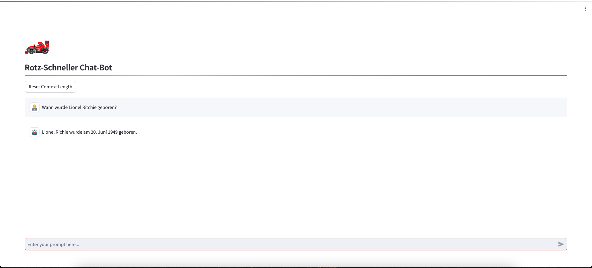

# GROQ ChatBot

## Description

The GROQ ChatBot is a Streamlit application that allows users to interact with an AI model and receive answers to their questions. The application uses the GROQ API to generate the AI model's answers and provides a user-friendly interface to use the chatbot.

## Screenshot



## Installation

1. make sure that you have installed Python 3.10 or higher.
2. clone the repository:

   ```
   git clone https://github.com/mmuyakwa/groq-chatbot.git
   ```

3. navigate to the project directory:

   ```
   cd groq-chatbot
   ```

4. create a virtual environment and activate it:

   ```
   python -m venv venv
   source venv/bin/activate
   ```

5. install the required packages:

   ```
   pip install -r requirements.txt
   ```

6. create an `.env` file in the project directory and add your GROQ API key:

   ```
   GROQ_API_KEY=gsk_YOUR-API-KEY-HERE
   ```

7. start the application:

   ```
   streamlit run app.py
   ```

   The application should now open in your default browser.

## Use

1. enter your question or prompt in the input field.
2. press the Enter key or click on the "Send" button.
3. the ChatBot will process your request and return an answer in German.
4. the chat history is saved in the application so that you can access it.
5. to reset the chat history, click on the "Reset Context Length" button.

## Licence

This project is licensed under the [MIT licence](LICENSE).

## Authors

- Michael Muyakwa

## Google-Links

> _See also:_ { 🔍 } [GROQ API](https://www.google.com/search?q=GROQ+API)
> { 🤖 } [Streamlit](https://www.google.com/search?q=Streamlit)
> { 📚 } [Python 3.10](https://www.google.com/search?q=Python+3.10)
>
> _You may also enjoy:_ { 🌐 } [Chatbots in Python](https://www.google.com/search?q=Chatbots+in+Python)
> { 🤖 } [AI Language Models](https://www.google.com/search?q=AI+Language+Models)
> { 💬 } [Natural Language Processing](https://www.google.com/search?q=Natural+Language+Processing)
